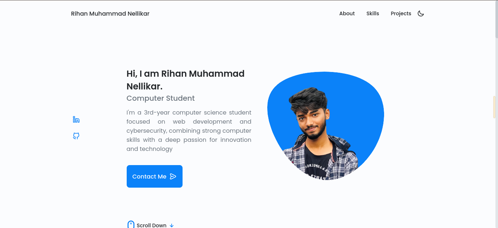
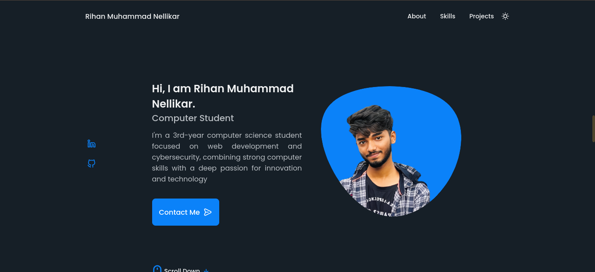

# Rihan's Responsive Portfolio Website
## Website URL: www.rihanmn.tech

- The design is based on [Bedimcode](https://github.com/bedimcode)
- The email service provider is [EmailJs](https://www.emailjs.com/)
- Contact form validations are added using [JavaScript](https://www.youtube.com/watch?v=fz8bwvn9lA4) 
- Normal alerts are replaced with Sweet Alert [SweetAlert](https://sweetalert.js.org)
- The favicon generator is [favicon.io](https://favicon.io/favicon-generator/)
- Added Google Tag script for [Google Analytics](https://analytics.google.com)
- Online meeting integration by [Calendly](https://calendly.com/)

### Landing Page Light

### Landing Page Dark

